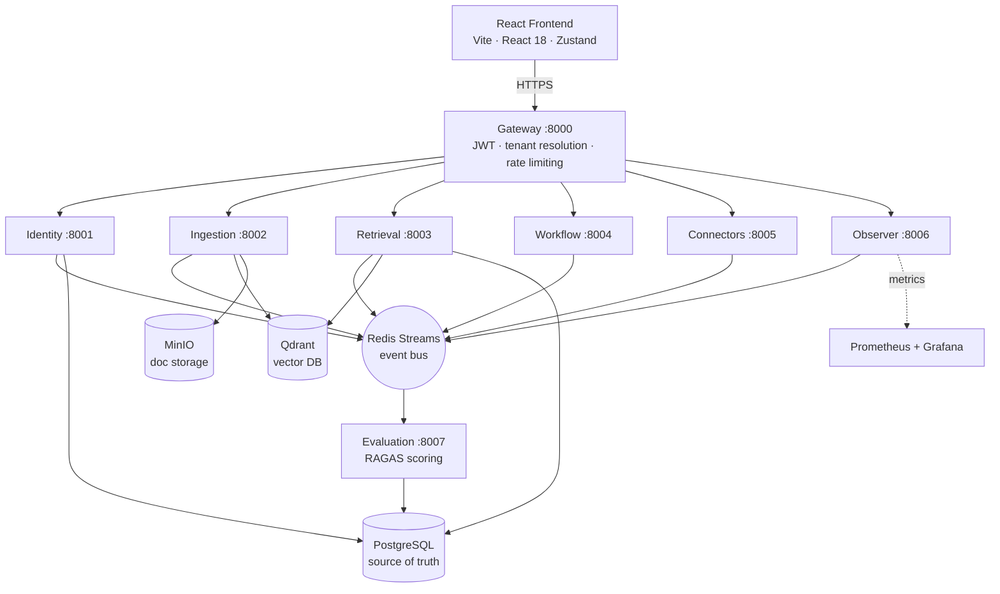
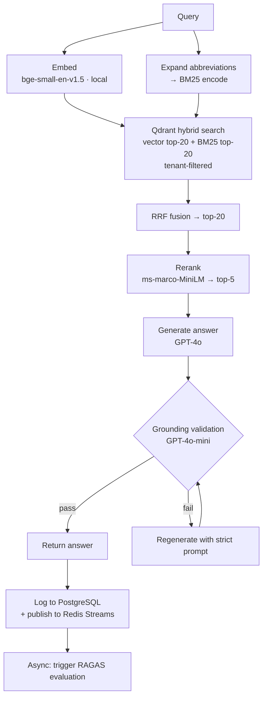

# Stratum

**A multi-tenant AI knowledge platform that searches across internal documentation and connected tools using natural language.**

Most RAG projects are demos. Stratum was built to find out what it actually takes to turn one into something that could run in production — grounded answers, continuous quality evaluation, per-tenant isolation, and full observability, built as independent services from the ground up.

Stratum ingests content, indexes it for hybrid retrieval, generates answers validated against their sources, and continuously evaluates retrieval quality using RAGAS so regressions can be caught before they reach users.

---

## Demo

### Screenshots

**Dashboard — live evaluation metrics and platform usage**


| Search — grounded answer with cited sources | Grafana — quality tracked over time |
|---|---|
|  |  |

| Workflows — checkpointed runs | Docs — indexed sources with chunk counts |
|---|---|
|  |  |

**Settings — workspace, roles, and API keys**


---

## Highlights

- **Hybrid retrieval** — dense vector similarity + BM25 keyword matching, fused with Reciprocal Rank Fusion (RRF) and refined with cross-encoder reranking
- **Grounded answers** — every answer is validated against the retrieved chunks before it's returned; if it can't be grounded, the pipeline regenerates with a stricter prompt instead of shipping something wrong
- **Continuous evaluation** — every search automatically triggers a background RAGAS evaluation (faithfulness, answer relevancy, context precision), so quality is tracked over time instead of by hand
- **Connector support** — built-in, webhook-based ingestion for Slack, GitHub, and Jira, alongside direct document upload
- **LangGraph workflows** — multi-step agent tasks, checkpointed in PostgreSQL so every run is resumable and inspectable
- **Strict multi-tenancy** — per-tenant data isolation at every layer (Postgres, Qdrant, Redis), with tenant identity flowing from the JWT, never the request body
- **Full observability** — Prometheus metrics and pre-built Grafana dashboards out of the box, plus a real-time audit log of every LLM call streamed via SSE
- **Auth** — JWT authentication with API key support, refresh tokens, and role-based access

---

## Benchmarks

Evaluated across 100 queries on 15 internal documents.

| Metric            | Score |
|-------------------|-------|
| Faithfulness      | 0.966 |
| Answer Relevancy  | 0.924 |
| Context Precision | 0.957 |
| **Overall RAGAS** | **0.941** |

---

## Architecture

Stratum follows a service-oriented architecture. The API gateway is the only public entry point; internal services communicate over HTTP for synchronous requests and Redis Streams for asynchronous events. Each service owns its data and can be developed and scaled independently.



---

## RAG Pipeline

Every search request runs this pipeline in fixed order:



---

## Tech Stack

| Layer | Technologies |
|---|---|
| **Backend** | FastAPI · Python 3.11 · ARQ · LangGraph |
| **AI** | GPT-4o (generation) · GPT-4o-mini (grounding) · bge-small-en-v1.5 (embeddings, local) · ms-marco-MiniLM (reranker, local) · RAGAS |
| **Storage** | PostgreSQL 15 · Qdrant · Redis 7 · MinIO |
| **Frontend** | React 18 · Vite · Zustand |
| **Infrastructure** | Docker Compose · Prometheus · Grafana |

---

## Quick Start

**Prerequisites:** Docker, Docker Compose, and an OpenAI API key.

```bash
# Clone the repo
git clone <repo-url> stratum
cd stratum/infrastructure

# Configure environment
cp .env.example .env
# Fill in OPENAI_API_KEY and credentials for Postgres, Redis, and MinIO.
# Also copy services/<name>/.env.docker.example → .env.docker for each service.

# Start everything
docker compose up --build -d

# Check service health
docker compose ps

# Start the frontend dev server
cd ../frontend && npm install && npm run dev
# → http://localhost:5173
```

Grafana: `http://localhost:3000` · default user `admin` · default password `stratum_admin`

---

## Services

| Service | Port | Description |
|---|---|---|
| gateway | 8000 | JWT auth, tenant resolution, rate limiting — only internet-facing service |
| identity | 8001 | Users, tenants, roles, API keys, refresh tokens |
| ingestion | 8002 | Document parsing, chunking, embedding, Qdrant indexing |
| retrieval | 8003 | Hybrid search, reranking, grounding validation, answer generation |
| workflow | 8004 | LangGraph agent orchestration and tool dispatch |
| connectors | 8005 | Slack, Jira, GitHub integrations and webhook ingestion |
| observer | 8006 | Audit log, LLM call tracking, SSE stream (subscribes to all Redis events) |
| evaluation | 8007 | RAGAS scoring on every search result |
| PostgreSQL | 5432 | Primary datastore |
| Qdrant | 6333 | Vector database |
| Redis | 6379 | Task queue and event bus |
| MinIO | 9000 | Object storage for raw documents |
| Prometheus | 9090 | Metrics collection |
| Grafana | 3000 | Dashboards |
| pgAdmin | 5050 | Postgres UI |

---

## Observability

Prometheus scrapes every service, and two Grafana dashboards ship with the repo:

- **Platform Overview** — documents ingested, total searches, workflow runs, average RAGAS score, and latency distribution
- **Infrastructure Monitoring** — per-service resource usage, Redis memory, Qdrant health, and Postgres connections

All services log via `structlog`. Every Redis Streams event carries a `tenant_id`. The observer service aggregates all events into a queryable audit log with real-time SSE streaming.

---

## Engineering Decisions

**Grounding validation is synchronous and blocks the response.** Returning an ungrounded answer and flagging it afterward puts the burden on the user to notice. Instead, when GPT-4o-mini finds that more than 15% of the answer isn't supported by the retrieved chunks, the pipeline regenerates immediately with a stricter prompt. The latency cost is real, but the alternative is silently wrong answers.

**RAGAS evaluation runs in a background task, not in the request path.** Scoring adds several seconds; running it synchronously would make every search feel slow. The retrieval endpoint fires an `asyncio.Task` after writing the log entry, so scoring completes without affecting p99 latency.

**Retrieval is read-only against Qdrant.** Only the ingestion service writes vectors. This means retrieval replicas can scale freely without worrying about write coordination or index consistency — the ingestion service is the sole owner of that state.

**Abbreviation expansion applies only to the sparse (BM25) path.** BM25 is a term-overlap model — "PR" won't match "pull requests" in the index, and expanding abbreviations fixes that. The dense embedding path gets the raw query, because semantic models handle abbreviations well and expansion can shift the embedding away from the user's actual intent.

**Tenant ID flows from the JWT, never the request body.** The gateway extracts the tenant claim and injects it as a trusted header. Internal services read that header — they never accept a caller-supplied tenant ID. Every Postgres query and every Qdrant search is pre-filtered on it, so there is no code path that can return cross-tenant data.
