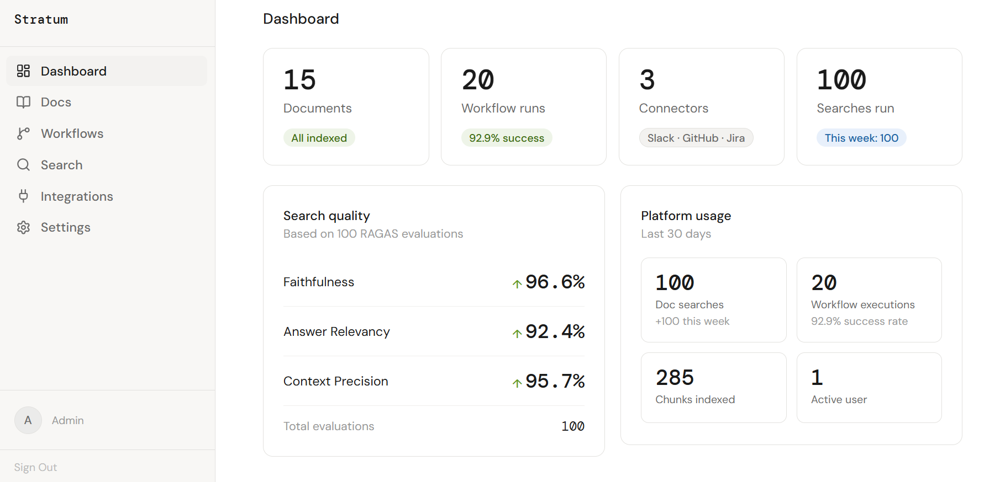
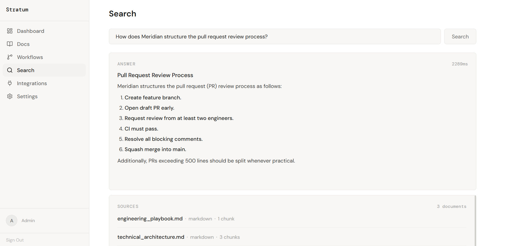
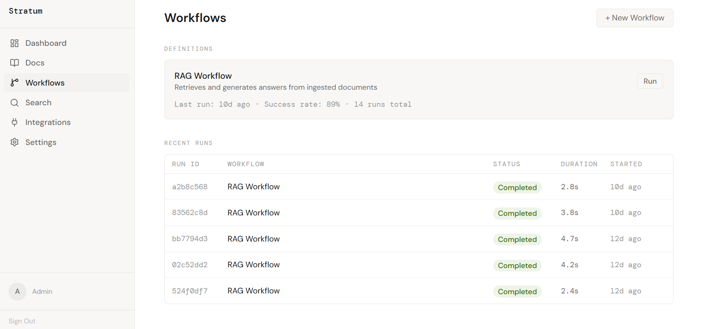
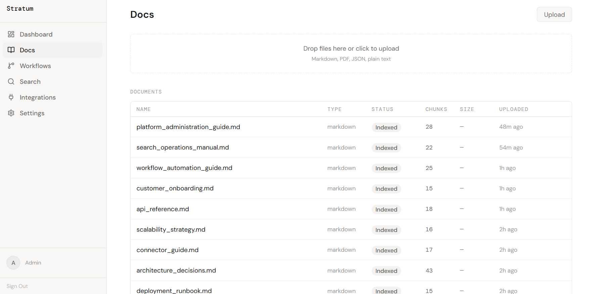
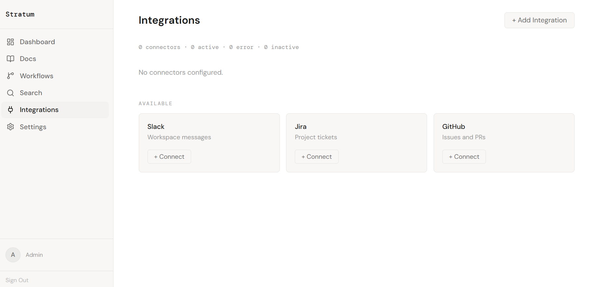
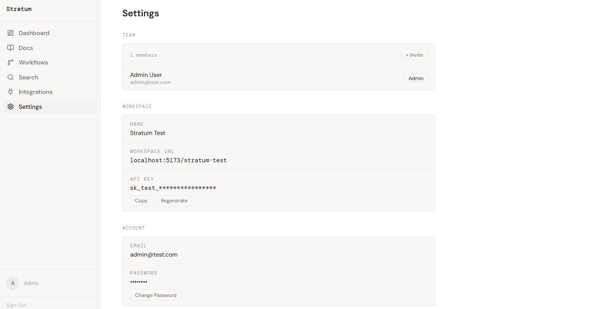
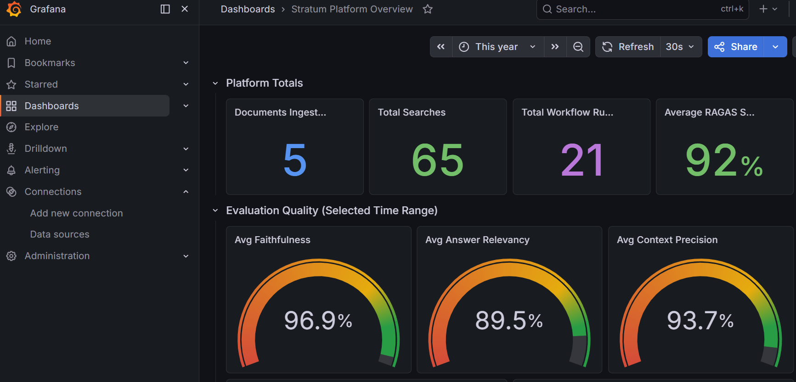

# Stratum

Stratum is a multi-tenant AI knowledge platform that lets teams search across internal documentation and connected tools such as Slack, GitHub, and Jira using natural language. It ingests content, indexes it for hybrid retrieval, generates grounded answers, and continuously evaluates retrieval quality using RAGAS so retrieval regressions can be detected before they affect users.

---

## Screenshots


<p align="center">
  
  
</p>
<p align="center">
  
  
</p>
<p align="center">
  
  
</p>
<p align="center">
  
</p>

---

## Benchmarks

Evaluated across 65 queries on five internal documents.

```
Overall RAGAS .......... 0.92
Faithfulness ........... 0.97
Answer Relevancy ....... 0.90
Context Precision ...... 0.94
```

---

## Highlights

- Upload documents (PDF, Markdown, or code) or connect Slack, Jira, and GitHub — ingestion runs in the background
- Hybrid search combining dense vector similarity and BM25 keyword matching, fused with RRF
- Answers generated by GPT-4o and validated against the retrieved chunks before returning to the user
- If an answer can't be grounded in the sources, the pipeline regenerates automatically with a stricter prompt
- Every search result is scored with RAGAS (faithfulness, answer relevancy, context precision) in the background
- LangGraph workflow engine for multi-step agent tasks with tool dispatch
- Full audit log of all LLM calls and events, streamed in real time via SSE
- Per-tenant data isolation at every layer — Postgres, Qdrant, and Redis all filter by tenant ID
- Prometheus metrics and pre-built Grafana dashboards out of the box
- JWT authentication with API key support, refresh tokens, and role-based access

---

## Use Cases

- Search internal engineering documentation
- Ask questions across company knowledge bases
- Build AI workflows on top of enterprise documents
- Connect Slack, GitHub, and Jira as knowledge sources
- Monitor retrieval quality with continuous RAGAS evaluation

---

## Architecture

Stratum follows a service-oriented architecture. The API gateway is the only public entry point; internal services communicate over HTTP for synchronous requests and Redis Streams for asynchronous events. Each service owns its data and can be scaled independently.

```
                          ┌─────────────────────────────────────────┐
                          │              React Frontend               │
                          │         (Vite · React 18 · Zustand)      │
                          └────────────────────┬────────────────────┘
                                               │ HTTPS
                          ┌────────────────────▼────────────────────┐
                          │               Gateway :8000              │
                          │     JWT validation · tenant resolution   │
                          │       rate limiting · header injection   │
                          └──┬──────┬──────┬──────┬──────┬──────┬──┘
                             │      │      │      │      │      │
              ┌──────────────▼─┐ ┌──▼───┐ │ ┌───▼──┐ ┌─▼───┐ │
              │ Identity :8001 │ │Ingest│ │ │Workfl│ │Conn.│ │
              │  users/tenants │ │:8002 │ │ │:8004 │ │:8005│ │
              └────────────────┘ └──┬───┘ │ └──┬───┘ └──┬──┘ │
                                    │     │    │        │    │
                          ┌─────────▼─┐ ┌─▼───▼──┐    │    │
                          │ Retrieval │ │Observer │    │    │
                          │   :8003   │ │  :8006  │    │    │
                          └─────┬─────┘ └────┬────┘    │    │
                                │            │         │    │
                          ┌─────▼────────────▼─────────▼────▼──────┐
                          │              Redis Streams               │
                          │        (event bus · all services)        │
                          └──────────────────┬──────────────────────┘
                                             │
                          ┌──────────────────▼──────────────────────┐
                          │           Evaluation :8007               │
                          │    RAGAS scoring · quality tracking      │
                          └──────────────────┬──────────────────────┘
                                             │
        ┌────────────────┬──────────────────┬┴─────────────────┐
        │                │                  │                   │
  ┌─────▼──────┐  ┌──────▼──────┐  ┌───────▼──────┐  ┌────────▼────────┐
  │ PostgreSQL │  │    Qdrant   │  │    MinIO     │  │ Prometheus +    │
  │   :5432    │  │    :6333    │  │  :9000/9001  │  │ Grafana :9090/  │
  │ source of  │  │  vector DB  │  │  doc storage │  │ :3000           │
  │   truth    │  │             │  │              │  └─────────────────┘
  └────────────┘  └─────────────┘  └──────────────┘
```

---

## Tech Stack

**Backend** · FastAPI · Python 3.11 · ARQ · LangGraph  
**AI** · GPT-4o (generation) · GPT-4o-mini (grounding) · `bge-small-en-v1.5` (embeddings, local) · `ms-marco-MiniLM` (reranker, local) · RAGAS  
**Storage** · PostgreSQL 15 · Qdrant · Redis 7 · MinIO  
**Frontend** · React 18 · Vite · Zustand  
**Infrastructure** · Docker Compose · Prometheus · Grafana

---

## RAG Pipeline

Every search request runs this pipeline in fixed order:

```
Query
  │
  ├─ embed (bge-small-en-v1.5, local)            dense vector
  ├─ expand abbreviations → BM25 encode           sparse vector
  │
  ▼
Qdrant hybrid search (asyncio.gather)
  ├─ vector top-20  (pre-filtered by tenant_id)
  └─ BM25 top-20    (pre-filtered by tenant_id)
  │
  ▼
RRF fusion → top-20 candidates
  │
  ▼
Rerank (ms-marco-MiniLM, local) → top-5
  │
  ▼
Generate answer (gpt-4o)
  │
  ▼
Grounding validation (gpt-4o-mini)
  ├─ pass  → return answer
  └─ fail  → regenerate with strict prompt → re-validate → return
  │
  ▼
Log to PostgreSQL + publish to Redis Streams
  │
  ▼
Async: trigger RAGAS evaluation (fire-and-forget)
```

### Benchmark scores

| Metric | Score |
|---|---|
| Faithfulness | 0.97 |
| Answer Relevancy | 0.90 |
| Context Precision | 0.94 |
| Overall | 0.92 |

---

## Quick Start

**Prerequisites:** Docker, Docker Compose, OpenAI API key.

```bash
# Clone the repo
git clone <repo-url> stratum
cd stratum/infrastructure

# Configure environment
cp .env.example .env
# Fill in OPENAI_API_KEY and credentials for Postgres, Redis, MinIO
# Also copy services/<name>/.env.docker.example → .env.docker for each service

# Start everything
docker compose up --build -d

# Check service health
docker compose ps

# Start the frontend dev server
cd ../frontend && npm install && npm run dev
# → http://localhost:5173
```

Grafana: `http://localhost:3000` · user `admin` · password `stratum_admin`

---

## Services

| Service | Port | Description |
|---|---|---|
| gateway | 8000 | JWT auth, tenant resolution, rate limiting — only internet-facing service |
| identity | 8001 | Users, tenants, roles, API keys, refresh tokens |
| ingestion | 8002 | Document parsing, chunking, embedding, Qdrant indexing |
| retrieval | 8003 | Hybrid search, reranking, grounding validation, answer generation |
| workflow | 8004 | LangGraph agent orchestration and tool dispatch |
| connectors | 8005 | Slack, Jira, GitHub integrations and webhook ingestion |
| observer | 8006 | Audit log, LLM call tracking, SSE stream (subscribes to all Redis events) |
| evaluation | 8007 | RAGAS scoring on every search result |
| PostgreSQL | 5432 | Primary datastore |
| Qdrant | 6333 | Vector database |
| Redis | 6379 | Task queue and event bus |
| MinIO | 9000 | Object storage for raw documents |
| Prometheus | 9090 | Metrics collection |
| Grafana | 3000 | Dashboards |
| pgAdmin | 5050 | Postgres UI |

---

## Observability

Prometheus scrapes all services; two Grafana dashboards ship with the repo. **Platform Overview** tracks documents ingested, total searches, workflow runs, average RAGAS score, and latency distribution. **Infrastructure Monitoring** tracks per-service resource usage, Redis memory, Qdrant health, and Postgres connections.

All services log via `structlog`. Every Redis Streams event carries `tenant_id`. The observer service aggregates all events into a queryable audit log with real-time SSE streaming.

---

## Engineering Decisions

**Grounding validation is synchronous and blocks the response.** Returning an ungrounded answer and flagging it after the fact puts the burden on the user to notice. Instead, when GPT-4o-mini finds that more than 15% of the answer isn't supported by the retrieved chunks, the pipeline regenerates immediately with a stricter prompt. The latency cost is real but the alternative is silently wrong answers.

**RAGAS evaluation runs in a background task, not in the request path.** Scoring adds several seconds. Running it synchronously would make every search feel slow. Instead, the retrieval endpoint fires an `asyncio.Task` after writing the log entry, so scoring completes without affecting p99 latency.

**Retrieval is read-only against Qdrant.** Only the ingestion service writes vectors. This means you can scale retrieval replicas freely without worrying about write coordination or index consistency — the ingestion service is the sole owner of that state.

**Abbreviation expansion applies only to the sparse (BM25) path.** BM25 is a term-overlap model — "PR" won't match "pull requests" in the index. Expanding abbreviations fixes that. The dense embedding path gets the raw query because semantic models handle abbreviations well, and expansion can shift the embedding away from the user's actual intent.

**Tenant ID flows from the JWT, never the request body.** The gateway extracts the tenant claim and injects it as a trusted header. Internal services read that header — they never accept a caller-supplied tenant ID. Every Postgres query and every Qdrant search is pre-filtered on it, so there is no code path that can return cross-tenant data.
